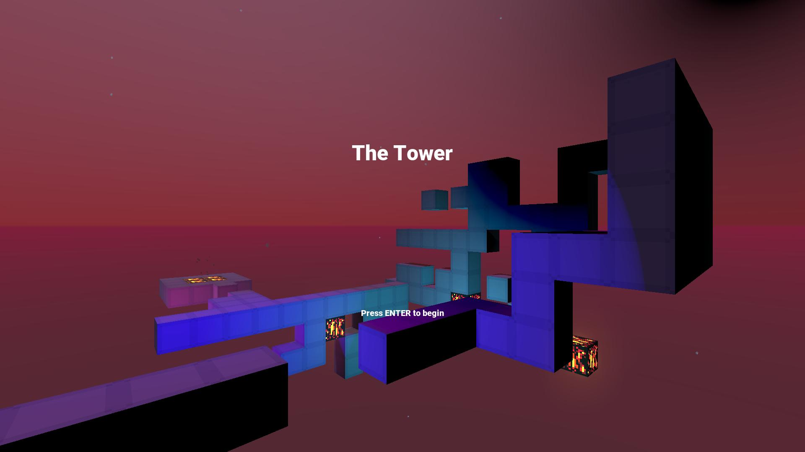
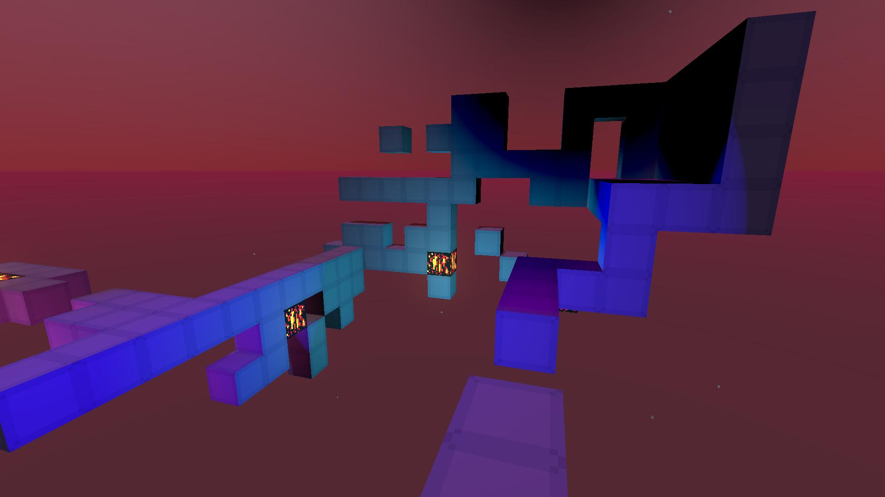
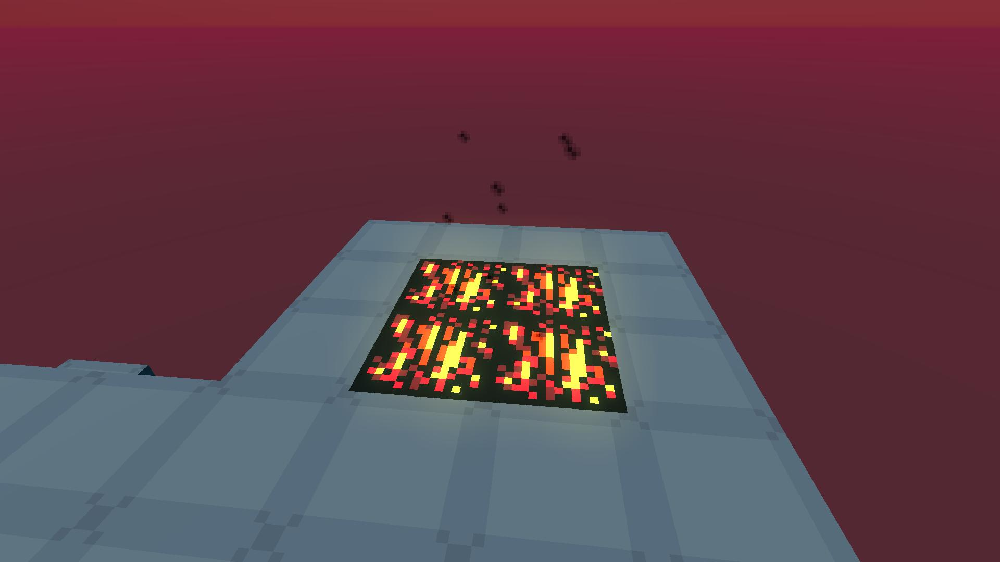
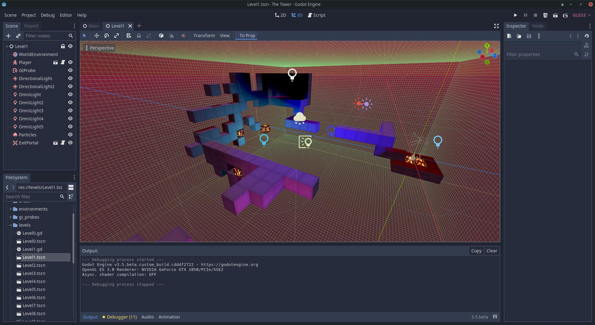

# The Tower

A really simple (and visually strange) demonstration project for Voxelman.

It is a first person parkour game. Reach the weird glowing teleporter at the end of each level.

In order to open this, you need to have a Godot built with [voxelman](https://github.com/Relintai/voxelman) added!

You can either just get an executable at the [releases tab](https://github.com/Relintai/the_tower/releases), or 
you can build one yourself see [here](#compiling).

You can also try a live version running in the browser [here](https://relintai.github.io/the_tower/).

Unfortunately the web editor needs custom http headers to work and I can't set that up from github.io, so right now I don't have a hosted version of that.

Uses GLES3, and is loaded with effects. It will likely make low powered devices (like phones) cry.

Should work on all platforms (even when there is no threading available).\
It does not have touchscreen controls tough.

## Controls

`w`,`a`,`s`,`d`: Movement \
`space`: jump (you can also double jump) \
`shift`: run \
`r`: reload level \
`esc`: ingame menu

## Screenshots






## Assets

### The sound effect

https://opengameart.org/content/foot-walking-step-sounds-on-stone-water-snow-wood-and-dirt

Author: \
Jute (Submitted by qubodup)\
Thursday, February 11, 2010 - 02:27\
Art Type: Sound Effect \
Tags: snow step walk walking movement dirt Wood water wet footstep foot run Action RPG Fantasy Other\
License(s): GPL 3.0, GPL 2.0

These sounds were made by Jute for DungeonHack. They are based on sounds from pdsounds.org.

I did modify the effect I use from it.

### The font

The font is licensed under the Apache License. (it's next to it.)

## Editing the game

Grab an engine which has voxelman built in, and then open the project inside the `game` folder.

## The provided engine

Currently this project uses [my fork](https://github.com/Relintai/godot) of godot (3.x). \
This contains a port of [TokageItLab's SkeletonEditor pr](https://github.com/godotengine/godot/pull/45699).\
The original godot source will work, if you want to use that in your build.

Also, it doesn't just come with voxelman and it's optional dependencies, I decided to include (keep), 
some of my more useful modules aswell.

here's the full list:

https://github.com/Relintai/entity_spell_system.git \
https://github.com/Relintai/ui_extensions.git \
https://github.com/Relintai/texture_packer.git \
https://github.com/Relintai/godot_fastnoise.git \
https://github.com/Relintai/mesh_data_resource.git \
https://github.com/Relintai/props.git \
https://github.com/Relintai/mesh_utils.git \
https://github.com/Relintai/thread_pool.git \
https://github.com/Relintai/voxelman.git

If you don't want some of these in your build, then you can remove them by editing the project's [module_config.py](https://github.com/Relintai/the_tower/blob/master/module_config.py) file.


## Compiling

First make sure, that you have everything installed to be able to compile the godot engine. See [the official docs for compiling Godot](https://docs.godotengine.org/en/latest/development/compiling/index.html) for more info. My setup/compile script uses the same tools, so
you don't need to install anything else.

Now let's clone this repository:

``` git clone https://github.com/Relintai/the_tower ```

cd into the new folder:

``` cd the_tower ```

Now let's run the project's setup script, by calling scons without arguments.

``` scons ```

This will clone and setup the engine, and all of the required modules into a new `engine` folder inside the project, using http.

(If you want to use the github's ssh links append `repository_type=ssh` like ``` scons repository_type=ssh ```)

Once it is done you can compile the engine.

To build the editor on windows with 4 threads run the following command:

``` scons bew -j4 ```

To build the editor on linux with 4 threads run the following command:

``` scons bel -j4 ```

I call this feature of the setup script build words. [See](#build-words).

Once the build finishes you can find the editor executable inside the `./engine/bin/` folder.

For convenience there is a provided `editor.sh`, or `editor.bat` for running it from the project's folder.
These will create a copy, so you can even compile while the editor is running.

Alternatively if you don't want to use build words, you can also just go into the engine folder:

``` cd engine ```

And compile godot as per the [official docs](https://docs.godotengine.org/en/latest/development/compiling/index.html).

### Build words

The project's setup script contains support for "build words". These can be used from the root of this project.

For example to build the editor for windows with 4 threads you can use:

``` scons bew -j4 ```

The first argument must start with b (build), then it needs to be followed by a few abbreviations (the order does not matters)

The rest of the arguments will be passed directly to godot's scons script.

#### Editor

Append `e` to build with `tools=yes` a.k.a. the editor.

``` scons bew -j4 ```

if you omit `e`, the system will build the export template for you. For example:

``` scons bw -j4 ```

This will be the `release_debug` windows export template.

#### Platform abbreviations

`l`: linux \
`w`: windows \
`a`: android \
`j`: Javascript \
`i`: iphone (Not yet finished, use `build_ios.sh`, and `build_ios_release.sh`) \
Mac OSX: Not yet finished, use `build_osx.sh`

#### Target abbreviations

By default the system builds in release_debug.

Append `d` for debug, or `r` for release.

``` scons bewd -j4 ```

build editor windows debug

``` scons bwr -j4 ```

build windows release (this will build the windows release export template)

#### Shared modules

Note: This only works on linux!

append `s` to the build string. 

Optionally you can also make the build system only build a target module, by appending one of these:

`E`: Entity Spell System \
`T`: Texture Packer \
`V`: Voxelman \
`W`: World Generator \
`P`: Procedural Animations

Example:

``` scons belsE -j4 ```

build editor linux shared (Entity Spell System) with 4 threads

Note: to easily run the editor you can use the `editor.sh` or `editor.bat` in the root of the project.

#### Other

Append `v` to pass the `vsproj=yes` parameter to the build script. This will generate Visual Studio project files.

#### Postfixes

There are a few postfixes for the build words. These are more complex options. You have to append them to your build word with an underscore.

You can use as many as you want.

For example:

``` scons bel_slim_latomic -j4 ```

##### slim

With this postfix you can build a slimmed down version of the engine. This disables quite a few unneeded modules.

``` scons bel_slim -j4 ```

##### latomic

If you get linker errors while building the game/editor about undefined referenced with atomic related functions you can use this postfix.
It will add the ` -latomic ` command line switch to the linker flags.

I ran into this issue while building on a raspberry pi 4 with the x11 platform. It might be related to the recent reworks to threading.

``` scons bel_latomic -j4 ```

##### strip

Appends `debug_symbols=no` to the build command, which will strip the resulting binary from debug symbols.

``` scons bel_strip -j4 ```

##### threads

Appends `threads_enabled=yes` to the build command. Useful for building the editor for html.

``` scons bej_threads -j4 ```

#### Scons cache, and sdk locations

In order to use scons cache and to tell the build system where some of the required sdks are located you usually 
have to use environment variables. Most of the time you might just want to add them globally, 
howewer this is sometimes unfeasible (e.g. you don't have administrator access, or you just want to have
multiple sdk versions installed).

In order to solve this a build config file was added.

If you want to use the config simply rename the provided `build.config.example` to `build.config`, and customize 
the settings inside.

### Manual Setup

If you you don't want to use the setup script (or just want to know what it actually does), 
this section will explain how to set everything up manually.

First clone godot. Either my fork (recommended at the moment):

``` git clone https://github.com/Relintai/godot.git ```

or the official 3.x master:

``` git clone https://github.com/godotengine/godot.git -b 3.x ```

go into engine's modules fodler.

``` cd godot/modules/ ```

Now go ahead and get every single required engine module from [here](#the-required-engine-modules).

``` cd ../../ ```

Now if you look at the [HEADS file](https://github.com/Relintai/the_tower/blob/master/HEADS).

It contains the commit hashes for that particular revision for every module and the engine.

You need to go through them and checkout the proper commits.

Now you can go ahead and compile godot normally.

## Pulling upstream changes

First pull the changes by calling

``` git pull orgin master ```

Then just run `scons`, to update the modules.

## Upgrading the modules

Note: this is how to update the HEADS file. Normally you don't need to do this.

If you want to update the modules, and the engine to the latest, you can use (`action=update`):

``` scons a=u ``` 

You can also update different targets: `all`, `engine`, `modules`, `all_addons`, `addons`, `third_party_addons`

For example to update the engine to the latest: ``` scons a=u target=engine ```


